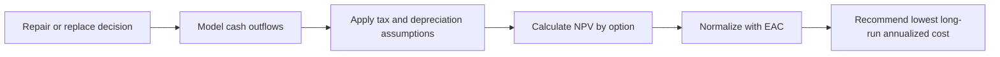

# Capital Budgeting Case Study

Portfolio project applying capital budgeting techniques to a vessel repair-versus-replace decision.

Original academic project associated with Texas A&M University-Corpus Christi.

## Project Focus

Rio Negro Inc. needed to decide whether to keep operating the Maracas cargo ship through an overhaul or replace it with a new vessel. The analysis compared three options:

- Basic overhaul of the existing vessel
- Advanced overhaul with a new engine and control system
- Purchase and operation of a new cargo ship

The portfolio version focuses on the financial modeling work:

- Comparing alternatives with different useful lives
- Estimating present value of long-term cash outflows
- Applying tax and depreciation assumptions
- Using equivalent annual cost to normalize options across time horizons
- Translating model outputs into an executive recommendation

## Method

The analysis used net present value for the two overhaul options because both extended the vessel life by 12 years. Equivalent annual cost was used to compare the overhaul options with the new-vessel option because the replacement vessel had a longer 20-year operating horizon.

## Key Result

The advanced overhaul was more cost-effective than the basic overhaul when comparing the 12-year repair alternatives by present value of cost.

When all options were normalized with equivalent annual cost, purchasing the new vessel was the preferred long-term decision despite the higher initial cost.

| Option | Horizon | Primary Metric | Result |
| --- | ---: | --- | ---: |
| Basic overhaul | 12 years | NPV of cost | -$6,261,849.33 |
| Advanced overhaul | 12 years | NPV of cost | -$5,946,740.88 |
| Basic overhaul | 12 years | EAC | -$756,044.76 |
| Advanced overhaul | 12 years | EAC | -$717,999.12 |
| New vessel | 20 years | EAC | -$618,931.03 |

The new vessel also offered operational advantages, including automated navigation, improved crew accommodations, and larger storage capacity.

## Project Contents

- [data/decision_metrics.csv](data/decision_metrics.csv) - cleaned summary of the NPV and EAC results
- [data/model_assumptions.csv](data/model_assumptions.csv) - high-level assumptions used in the analysis
- [diagrams/decision_workflow.mmd](diagrams/decision_workflow.mmd) - Mermaid workflow diagram
- [docs/project-summary.md](docs/project-summary.md) - concise project context and portfolio notes

## Skills Demonstrated

- Capital budgeting analysis
- Net present value modeling
- Equivalent annual cost comparison
- Depreciation and tax shield reasoning
- Multi-option financial decision modeling
- Executive recommendation writing
- Privacy-conscious portfolio curation

## Publishing Note

The original Word and Excel files are intentionally excluded from the public portfolio because they include classroom-report formatting, workbook metadata, and raw model details that are not needed for a concise portfolio presentation. This project keeps only the cleaned, derived artifacts needed to explain the work professionally.
