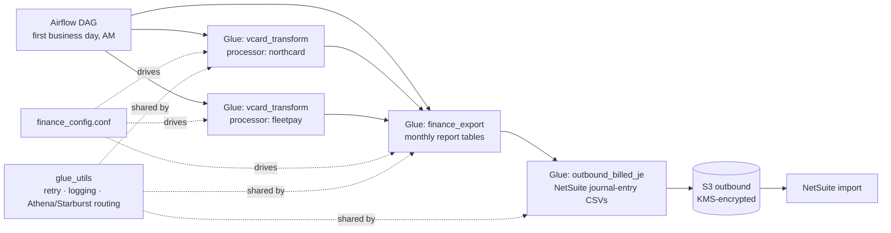

# Month-End Close ETL

Automation for the day-1 morning of a monthly financial close. An Airflow DAG
orchestrates configuration-driven AWS Glue jobs that build monthly reporting
tables, normalize virtual card revenue files from two payment processors, and
generate journal-entry CSVs for NetSuite import, with every outbound file
written to S3 under KMS (Key Management Service) encryption.

The point of the design is that accounting close is a scheduling and
correctness problem before it is a compute problem: the pipeline runs on the
first business day, tolerates upstream retries, and produces controllership
grade artifacts (journal entries, reconciliations) that a finance team books
from directly.

## Architecture

## What Each Piece Does

1. [`airflow/dags/finance_monthly_day1_am.py`](airflow/dags/finance_monthly_day1_am.py):
   business-day-aware orchestration. The close does not run on "the 1st"; it
   runs on the first business day, with dependencies ordered so journal
   entries are generated only after the report tables land.
2. [`code-bucket/scripts/glue/finance_export.py`](code-bucket/scripts/glue/finance_export.py):
   configuration-driven report generator. Which reports exist, where their SQL
   lives, and where results land is config, not code, so finance can add a
   report without a code change.
3. [`code-bucket/scripts/glue/vcard_transform.py`](code-bucket/scripts/glue/vcard_transform.py):
   normalizes virtual card revenue files from two processors with very
   different file conventions: NorthCard (a modern issuer-processor with
   clean snake_case exports) and FleetPay (a legacy fleet-payments processor
   whose CSVs arrive with mixed-case headers and per-day rows). One job, one
   schema-mapping config per processor, one standardized revenue table each.
4. [`code-bucket/scripts/glue/outbound_billed_je.py`](code-bucket/scripts/glue/outbound_billed_je.py):
   generates the billed journal-entry CSVs NetSuite imports on close day,
   summary and detail lines unioned per entity.
5. [`utils/glue_utils.py`](utils/glue_utils.py): the shared toolkit: retry
   with exponential backoff, signature logging, KMS-encrypted S3 writes,
   Glue Catalog helpers, and query routing that sends SQL to Athena in the
   dev account and Starburst in the lake accounts.
6. [`code-bucket/conf/finance_config.conf`](code-bucket/conf/finance_config.conf):
   the single configuration surface: buckets, roles, source paths, report
   definitions, and per-processor column/schema mappings.

## Patterns Worth Stealing

- **Config-driven jobs**: the report list and processor schemas live in one
  `.conf` file; adding a report or a processor is a config diff reviewers can
  read in seconds.
- **Business-day scheduling**: close automation keyed to business days, not
  calendar days, with the holiday behavior in one place.
- **Encrypted outbound by default**: every file that leaves the lake for
  NetSuite is written with a KMS key derived from the target account.
- **One retry policy**: a shared decorator with backoff instead of per-job
  retry loops, so failure behavior is uniform and greppable.

## Provenance

Reconstructed from screenshots of production work for demonstration of the
architecture and coding patterns; processor names are fictional stand-ins,
account identifiers are placeholders, and two marked gaps remain where the
source was not visible. All Python passes syntax validation; the jobs expect
a real Glue/Airflow environment to execute.
